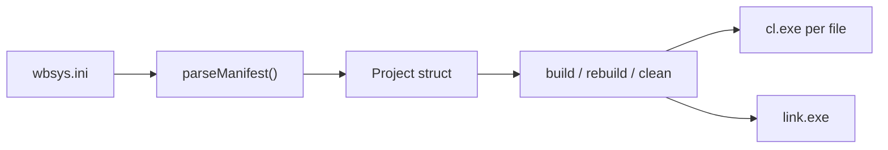

# BSys Documentation

`wbsys.ini` drives everything BSys does — sources, flags, defines, includes,
debug symbols, and console output. This folder breaks the manifest format
down by topic.

| Doc | Covers |
| --- | --- |
| [`manifest-format.md`](./manifest-format.md) | Section syntax, key reference tables, variable expansion |
| [`build-messages.md`](./build-messages.md) | `message` vs `compile_msg`, template variables, per-file overrides |
| [`verbosity.md`](./verbosity.md) | The three console output modes and when each line prints |
| [`debug-symbols.md`](./debug-symbols.md) | The `pdb` option and the `/Zi` `/Fd` `/DEBUG` `/PDB` flags it emits |
| [`resource-files.md`](./resource-files.md) | Compiling `.rc` files with `rc.exe` and linking the resulting `.res` |
| [`examples/`](./examples) | Full, runnable `.ini` manifests for common setups |

> [!TIP]
> Every doc in this folder is standalone — you can link directly to a
> section (e.g. `manifest-format.md#project`) without reading the others
> first.

## Quick orientation

A manifest has four kinds of section:

- `[project]` — one block, global settings (`docs/manifest-format.md#project`)
- `[variables]` — one block, `${name}`-style substitutions
- `[defaults]` — one block, flags/defines/includes applied to every file
- `[file:<path>]` — one block **per source file**, can override anything
  defaults set and add a `compile_msg`

Read [`manifest-format.md`](./manifest-format.md) next for the full key
reference.
