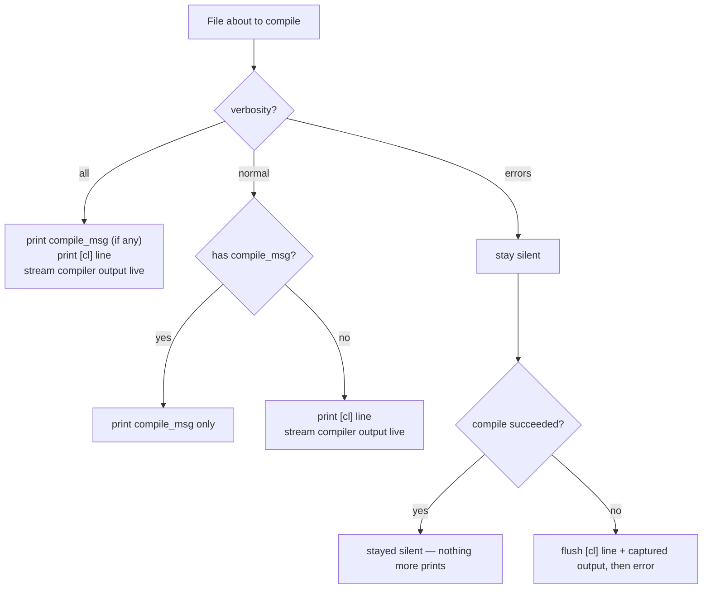

# Verbosity

`verbosity` is a single `[project]` key controlling how much console
noise a build produces. It only affects **per-file** output — the global
`message` (if set) still prints once regardless.

```ini
[project]
verbosity=errors
```

| Value | Meaning |
| --- | --- |
| `normal` *(default)* | Files with `compile_msg` show only that message; files without one behave exactly like BSys always has |
| `all` | Show everything for every file — `compile_msg`, the `[cl]` line, and live compiler output, even when a custom message is set |
| `errors` | Show nothing on success; on a failing file, print the `[cl]` line and the compiler's captured output so you can diagnose it |

## Decision table



## Why `errors` needs output capturing

`cl.exe` writes its banner and the source filename straight to the
console; BSys can't intercept that once the child process is inherited
directly. To support `errors` and the suppressed branch of `normal`,
BSys instead runs the compiler with its stdout/stderr redirected into a
pipe and buffers it in memory:

- **Success + suppressed** → the buffer is discarded.
- **Failure** → the buffer is flushed to the console right before the
  `WBSys: compile failed (...)` line, so you still get the full compiler
  diagnostics for the one file that broke.

`all` and default `normal` (no `compile_msg`) skip capturing entirely and
let the child process write straight to the console, which is why their
output still streams live instead of appearing in one block at the end.

## Examples

<details>
<summary><strong>Quiet CI build — only see problems</strong></summary>

```ini
[project]
name=WBSys
verbosity=errors

[file:src\main.cpp]
[file:src\builder.cpp]
[file:src\manifest.cpp]
```

```text
Compiled 3 file(s), skipped 0 (up to date)
[link] -> build\WBSys.exe
Build OK: build\WBSys.exe
```

A broken file, on the other hand, still surfaces everything needed to
fix it:

```text
[cl]   src\manifest.cpp
manifest.cpp
src\manifest.cpp(41): error C2065: 'foo': undeclared identifier
WBSys: compile failed (2): src\manifest.cpp
```

</details>

<details>
<summary><strong>Force full output even with custom messages</strong></summary>

```ini
[project]
verbosity=all

[file:src\main.cpp]
compile_msg=[CC] Compiling ${file}
```

```text
[CC] Compiling src\main.cpp
[cl]   src\main.cpp
Microsoft (R) C/C++ Optimizing Compiler Version 19.44.35228 for x64
Copyright (C) Microsoft Corporation.  All rights reserved.
main.cpp
```

</details>
